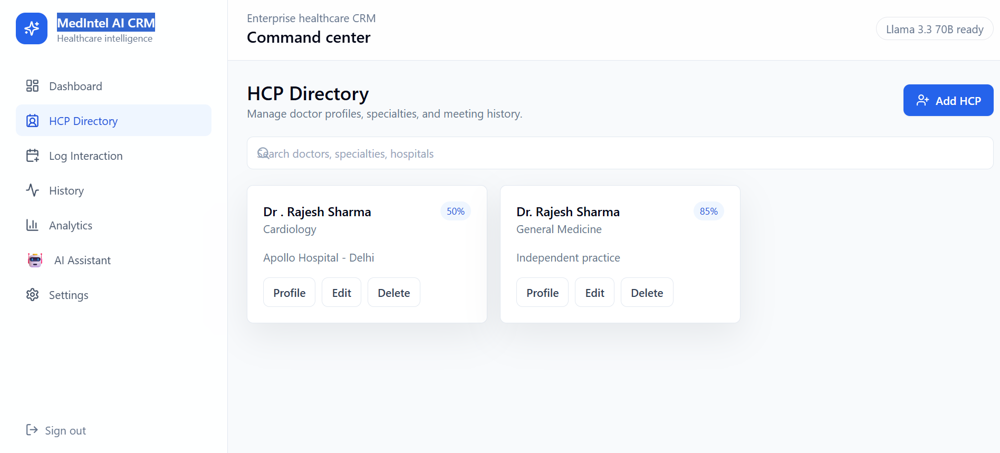

# 🏥 MedIntel AI CRM

> An AI-powered Healthcare CRM platform designed to help Medical Representatives efficiently manage Healthcare Professionals (HCPs), interactions, analytics, and intelligent follow-up planning using Large Language Models.

<p align="center">
  
  
  
  
  
  
</p>

---

# 📖 Overview

**MedIntel AI CRM** is a modern AI-first Healthcare Customer Relationship Management platform built for pharmaceutical sales teams.

The platform enables Medical Representatives to maintain Healthcare Professional records, track meetings, analyze engagement, monitor follow-ups, and leverage AI to generate summaries, insights, and intelligent recommendations.

The project combines modern frontend technologies with FastAPI and LangGraph-powered AI workflows to deliver a smarter CRM experience.

---

# ✨ Key Features

### 📊 Smart Dashboard

- Total HCP statistics
- Today's meetings
- Pending follow-ups
- Monthly interaction analytics
- Recent CRM activity
- Sentiment overview

---

### 👨‍⚕️ Healthcare Professional Directory

- Add Healthcare Professionals
- Edit details
- Delete records
- Search doctors
- Track engagement score

---

### 📝 Interaction Management

- Log meetings
- Record discussion notes
- Product conversations
- Follow-up reminders
- Meeting history

---

### 🤖 AI Assistant

Powered by **LangGraph + Groq Llama 3.3 70B**

Capabilities include:

- Interaction summarization
- AI follow-up planning
- Professional email drafting
- Analytics explanation
- CRM insights
- Sentiment analysis

---

# 🛠 Technology Stack

## Frontend

- React 19
- TypeScript
- Vite
- Tailwind CSS
- Framer Motion
- Recharts

## Backend

- FastAPI
- Python
- SQLAlchemy
- PostgreSQL

## Artificial Intelligence

- LangGraph
- Groq API
- Llama 3.3 70B

## DevOps

- Docker
- Docker Compose
- Nginx

---

# 📂 Project Structure

```
MedIntel-AI-CRM
│
├── backend/
│
├── frontend/
│
├── screenshots/
│   ├── dashboard.png
│   ├── hcp-directory.png
│   └── ai.assistant.png
│
├── docker-compose.yml
├── .env.example
├── README.md
└── .gitignore
```

---

# 📸 Application Screenshots

## 🏠 Dashboard


The dashboard provides an overview of HCP statistics, meeting schedules, follow-up tasks, monthly interactions, and CRM activity.

---

## 👨‍⚕️ HCP Directory


Manage Healthcare Professionals through complete CRUD operations with search and engagement tracking.

---

## 🤖 AI Assistant



AI-powered assistant capable of summarizing interactions, generating follow-up plans, explaining analytics, drafting emails, and providing CRM intelligence.

---

# 🚀 Getting Started

## Clone Repository

```bash
git clone https://github.com/akshayattri01/MedIntel-AI-CRM.git

cd MedIntel-AI-CRM
```

---

## Environment Variables

Create a `.env` file using `.env.example`.

Example:

```
DATABASE_URL=
GROQ_API_KEY=
```

---

## Run using Docker

```bash
docker-compose up --build
```

---

## Run Frontend

```bash
cd frontend

npm install

npm run dev
```

---

## Run Backend

```bash
cd backend

pip install -r requirements.txt

uvicorn app.main:app --reload
```

---

# 🤖 AI Workflow

The AI Assistant can:

- Summarize doctor interactions
- Generate intelligent follow-up plans
- Draft professional emails
- Explain CRM analytics
- Analyze doctor sentiment
- Recommend next best actions

---

# 🔮 Future Enhancements

- Authentication & Authorization
- Role-based Access Control
- Calendar Integration
- Notification System
- Voice Assistant
- Mobile Application
- Cloud Deployment
- WhatsApp Integration

---

# 👨‍💻 Author

**Akshay Attri**

📧 Email: aashuattri01@gmail.com

🔗 GitHub

https://github.com/akshayattri01

🔗 LinkedIn

https://www.linkedin.com/in/aashu-attri-24616a24b

---

# ⭐ Support

If you found this project useful, consider giving it a ⭐ on GitHub.

It helps the project grow and supports future development.

---

# 📄 License

This project is licensed under the MIT License.