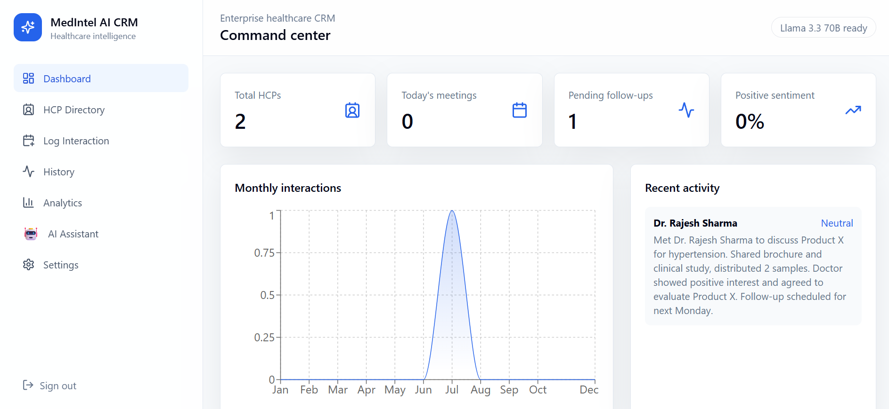
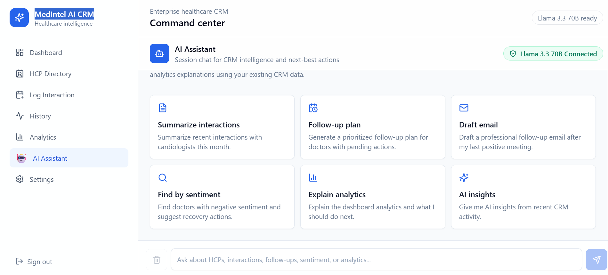

# 🏥 MedIntel AI CRM

> An AI-powered Healthcare CRM platform designed for Medical Representatives to efficiently manage Healthcare Professionals (HCPs), track interactions, monitor follow-ups, analyze engagement, and leverage AI-powered insights using Large Language Models.

<p align="center">
  
  
  
  
  
  
  
</p>

---

# 🌐 Live Demo

## 🚀 Live Frontend

**URL**

https://med-intel-ai-91anqagz3-aashu-attri-s-projects.vercel.app/

---

## ⚙️ Live Backend API

**URL**

https://medintel-ai-crm.onrender.com

---

## 📚 Swagger API Documentation

**URL**

https://medintel-ai-crm.onrender.com/docs

Use the interactive Swagger UI to explore and test all backend REST APIs.

---

## 💻 GitHub Repository

https://github.com/akshayattri01/MedIntel-AI-CRM

---

# 📖 Overview

**MedIntel AI CRM** is a modern AI-powered Healthcare Customer Relationship Management platform built for Pharmaceutical Sales Teams and Medical Representatives.

The platform enables users to:

- Manage Healthcare Professionals (HCPs)
- Record doctor interactions
- Track follow-ups
- Monitor engagement analytics
- Generate AI-powered summaries
- Draft professional emails
- Analyze sentiment
- Receive intelligent follow-up recommendations

By combining **React**, **FastAPI**, **PostgreSQL**, and **LangGraph-powered AI**, MedIntel AI CRM delivers a smarter, more efficient healthcare CRM solution.

---

# ✨ Key Features

## 📊 Smart Dashboard

- HCP Statistics
- Today's Meetings
- Pending Follow-ups
- Monthly Interaction Analytics
- Recent CRM Activity
- Sentiment Overview

---

## 👨‍⚕️ Healthcare Professional Directory

- Add Healthcare Professionals
- Edit Details
- Delete Records
- Search Doctors
- Engagement Score Tracking

---

## 📝 Interaction Management

- Log Meetings
- Discussion Notes
- Product Conversations
- Meeting History
- Follow-up Planning
- CRM Timeline

---

## 🤖 AI Assistant

Powered by **LangGraph + Groq Llama 3.3 70B**

Features include:

- AI Interaction Summaries
- Intelligent Follow-up Planning
- Professional Email Drafting
- CRM Insights
- Sentiment Analysis
- Next Best Action Recommendations

---

## 📈 Analytics

- Monthly Interaction Reports
- Follow-up Analytics
- HCP Engagement Trends
- CRM Performance Dashboard

---

# 🛠 Technology Stack

## Frontend

- React 19
- TypeScript
- Vite
- Tailwind CSS
- Framer Motion
- Recharts

---

## Backend

- Python
- FastAPI
- SQLAlchemy
- PostgreSQL
- JWT Authentication

---

## Artificial Intelligence

- LangGraph
- Groq API
- Llama 3.3 70B

---

## DevOps

- Docker
- Docker Compose
- Nginx
- Render
- Vercel

---

# 📂 Project Structure

```text
MedIntel-AI-CRM
│
├── backend/
│   ├── app/
│   ├── migrations/
│   ├── requirements.txt
│
├── frontend/
│   ├── src/
│   ├── public/
│
├── screenshots/
│   ├── dashboard.png
│   ├── hcp-directory.png
│   ├── interaction.png
│   ├── analytics.png
│   └── ai-assistant.png
│
├── docker-compose.yml
├── .env.example
├── README.md
└── .gitignore
```

---

# 📸 Application Screenshots

## 🏠 Dashboard



---

## 👨‍⚕️ HCP Directory



---

## 📝 Interaction Management


---

## 📈 Analytics


---

## 🤖 AI Assistant


---

# 🚀 Getting Started

## Clone Repository

```bash
git clone https://github.com/akshayattri01/MedIntel-AI-CRM.git

cd MedIntel-AI-CRM
```

---

# 🔑 Environment Variables

Create a `.env` file using `.env.example`.

Example:

```env
DATABASE_URL=

JWT_SECRET_KEY=

JWT_ALGORITHM=

ACCESS_TOKEN_EXPIRE_MINUTES=

GROQ_API_KEY=

FRONTEND_URL=
```

---

# ▶️ Run Backend

```bash
cd backend

pip install -r requirements.txt

python -m uvicorn app.main:app --reload
```

Backend

```
http://127.0.0.1:8000
```

Swagger

```
http://127.0.0.1:8000/docs
```

---

# ▶️ Run Frontend

```bash
cd frontend

npm install

npm run dev
```

Frontend

```
http://localhost:5173
```

---

# 🐳 Run using Docker

```bash
docker-compose up --build
```

---

# 🔗 REST API Endpoints

## Authentication

- POST `/api/v1/auth/register`
- POST `/api/v1/auth/login`
- POST `/api/v1/auth/logout`
- POST `/api/v1/auth/refresh`

---

## Healthcare Professionals

- Create HCP
- Update HCP
- Delete HCP
- View HCP Directory

---

## Interactions

- Log Interaction
- View Interaction History
- Follow-up Management

---

## AI

- Generate AI Summary
- Sentiment Analysis
- Follow-up Recommendation
- Email Generation

---

# 🤖 AI Workflow

The AI Assistant can:

- Summarize Doctor Meetings
- Generate Follow-up Plans
- Draft Professional Emails
- Explain CRM Analytics
- Analyze Doctor Sentiment
- Recommend Next Best Actions

---

# 🔮 Future Enhancements

- Role-Based Authentication
- Calendar Integration
- Notification System
- Voice Assistant
- WhatsApp Integration
- Mobile Application
- Multi-user Collaboration
- Advanced AI Insights

---

# 👨‍💻 Author

**Akshay Attri**

📧 **Email**

aashuattri01@gmail.com

---

💻 **GitHub**

https://github.com/akshayattri01

---

🔗 **LinkedIn**

https://www.linkedin.com/in/aashu-attri-24616a24b

---

🌐 **Live Frontend**

https://med-intel-ai-91anqagz3-aashu-attri-s-projects.vercel.app/

---

⚙️ **Backend API**

https://medintel-ai-crm.onrender.com

---

📚 **Swagger Documentation**

https://medintel-ai-crm.onrender.com/docs

---

# ⭐ Support

If you found this project useful, consider giving it a ⭐ on GitHub.

It helps support future development and improvements.

---

# 📄 License

This project is licensed under the **MIT License**.